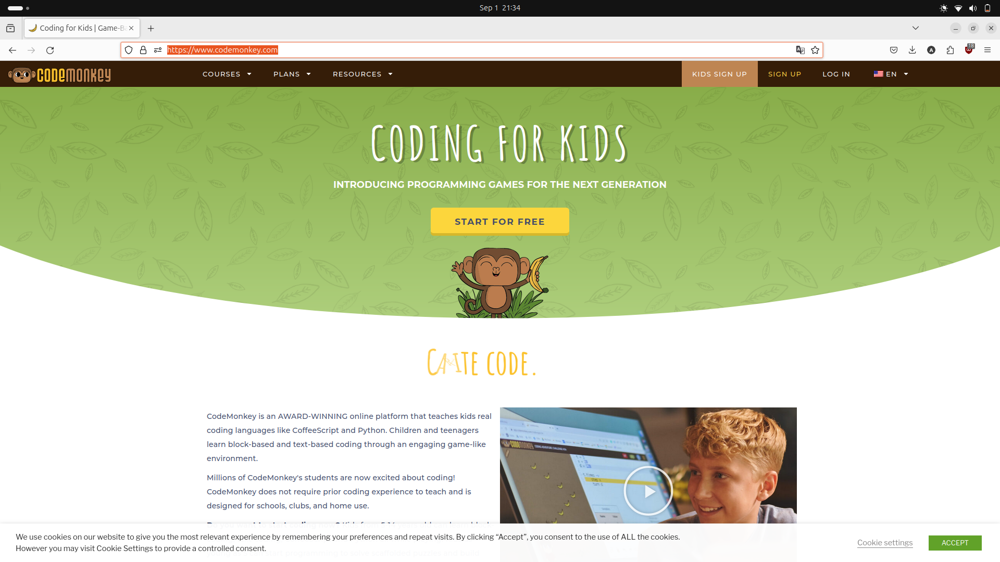
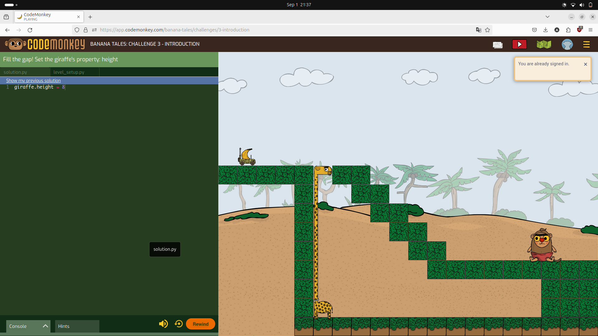
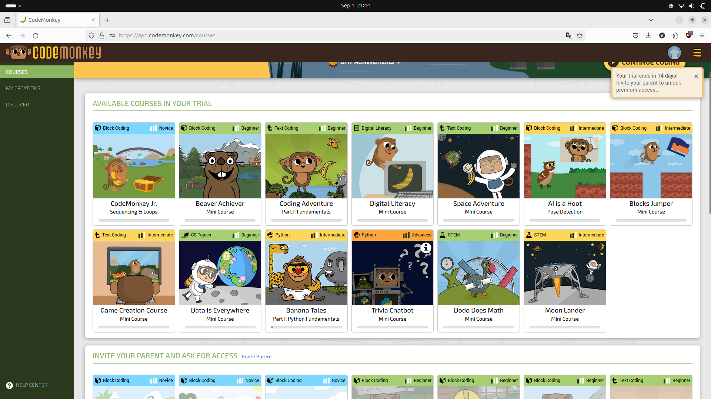
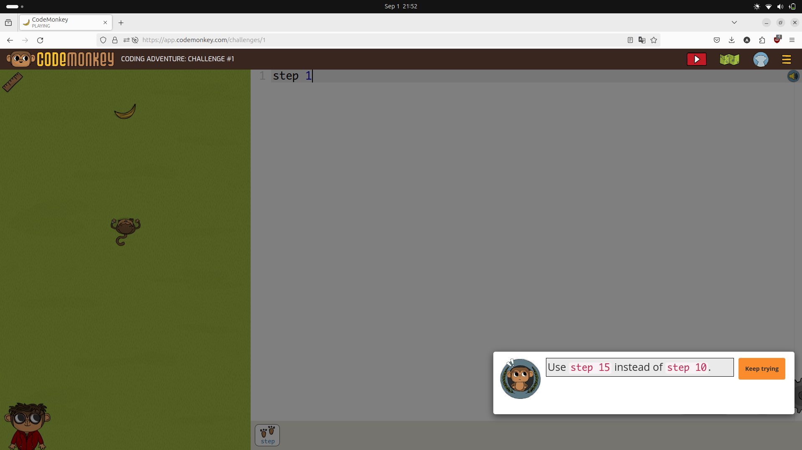

# Tugas Review Perangkat Lunak yang termasuk tutor, tool dan tutee.

##### Dibuat Oleh : Ari Yono

## Code Monkey
**CodeMonkey** adalah platform pembelajaran coding online yang dirancang khusus untuk anak-anak dan remaja. Dengan pendekatan yang menyenangkan dan interaktif, CodeMonkey berhasil mengubah proses belajar coding menjadi petualangan yang seru. CodeMonkey dapat dikunjungi pada laman https://www.codemonkey.com. 

Dengan konsep belajar sambil bermain anak-anak diajak untuk menyelesaikan misi-misi seru sambil secara tidak sadar mempelajari konsep-konsep dasar pemrograman seperti variabel, loop, dan fungsi.

Contoh berikut merupakan course pembelajaran python pada CodeMonkey.
Siswa diminta untuk menyelesaikan persoalan agar pisang dapat sampai ke monyet dengan mengubah tinggi jerapah, mengubah tinggi jerapah menggunakan code editor yang disediakan pada layar sebelah kiri.

CodeMonkey menyediakan berbagai macam course dengan tema-tema yang menarik.

## Kelebihan CodeMonkey
- **Antarmuka yang Ramah Anak :** Desain antarmuka CodeMonkey sangat intuitif dan mudah digunakan, sehingga anak-anak dapat dengan cepat beradaptasi dan mulai coding.
- **Konsep Pemrograman Dasar :** CodeMonkey mencakup semua konsep dasar pemrograman yang penting, seperti variabel, loop, kondisi, fungsi, dan algoritma.
- **Umpan Balik yang Konstruktif :** CodeMonkey memberikan umpan balik yang jelas dan konstruktif kepada siswa, sehingga mereka dapat dengan mudah mengidentifikasi kesalahan dan memperbaiki kode mereka.

## Analisis CodeMonkey
CodeMonkey bertindak sebagai pembimbing dalam proses pembelajaran. Ia memberikan instruksi, soal latihan dan umpan balik secara bertahap. Ini sama seperti seorang tutor yang memberikan instruksi kepada muridnya. CodeMonkey menciptakan lingkungan belajar yang interaktif di mana siswa dapat langsung melihat hasil dari kode yang mereka tulis. Ini memungkinkan siswa untuk belajar dari kesalahan mereka dan mengembangkan pemahaman yang lebih dalam tentang konsep pemrograman.

CodeMonkey menyediakan platform di mana siswa dapat menulis dan menjalankan kode. Dalam hal ini, CodeMonkey berfungsi sebagai alat untuk mempraktikkan keterampilan pemrograman. Selain itu CodeMonkey juga menyediakan berbagai sumber daya pembelajaran, seperti tutorial, contoh kode, dan dokumentasi.

## Kesimpulan
CodeMonkey adalah kombinasi yang antara tutor dan tool. Platform ini tidak hanya memberikan instruksi dan bimbingan, tetapi juga menyediakan lingkungan yang memungkinkan siswa untuk mempraktikkan keterampilan mereka. Fokus utama CodeMonkey adalah sebagai tutor interaktif yang membimbing siswa dalam proses belajar pemrograman.