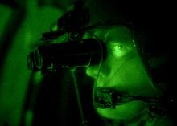
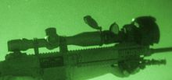
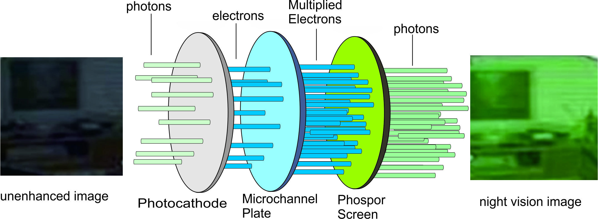

# Tugas PCD | Eksplorasi Alat Penangkap Citra
## NIGHT VISION DEVICE
Nama : Ari Yono  
NIM 2110131310001

## A. Night Vision Device
A Night-Vision Device (NVD), juga dikenal sebagai perangkat Night Optical/Observation Device (NOD) atau Night-Vision Goggle (NVG), adalah perangkat optoelektronik yang memungkinkan visualisasi gambar dalam tingkat cahaya rendah, meningkatkan penglihatan malam pengguna . Perangkat ini meningkatkan cahaya tampak sekitar dan mengubah cahaya inframerah dekat menjadi cahaya tampak yang kemudian dapat dilihat oleh manusia; ini dikenal sebagai I2 ( intensifikasi gambar ). Sebagai perbandingan, pengamatan radiasi termal inframerah disebut sebagai pencitraan termal dan beroperasi di bagian spektrum inframerah yang berbeda.

Perangkat penglihatan malam biasanya terdiri dari tabung penguat gambar , rumah pelindung, dan sistem pemasangan opsional. Banyak NVD juga menyertakan lensa pengorbanan pelindung, yang dipasang di atas lensa depan/objektif untuk mencegah kerusakan akibat bahaya lingkungan, sementara beberapa menyertakan lensa teleskopik . Gambar NVD biasanya berwarna hijau monokrom , karena hijau dianggap sebagai warna yang paling mudah dilihat dalam waktu lama dalam kegelapan. Perangkat penglihatan malam mungkin pasif, hanya mengandalkan cahaya sekitar, atau mungkin aktif, menggunakan iluminator IR (inframerah). Perangkat penglihatan malam dapat digenggam atau dipasang pada helm . Bila digunakan dengan senjata api, alat bidik laser IR sering dipasang pada senjata. Alat bidik laser menghasilkan sinar inframerah yang hanya terlihat melalui NVD dan membantu membidik. [ 3 ] Beberapa perangkat penglihatan malam dibuat untuk dipasang pada senjata api. Alat ini dapat digunakan bersama dengan alat bidik senjata atau berdiri sendiri; beberapa alat bidik senjata termal telah dirancang untuk menyediakan kemampuan serupa.

Berikut beberapa contoh alat Night-Vision Device :
1. Kacamata penglihatan AN/AVS-6

2. Teleskop pada M110

## B. Prinsip Kerja
- Photon (partikel cahaya) dari sumber dikumpulkan oleh lensa pada divais night vision dan mengenai photocathode.
- Photocathode adalah suatu material khusus yang ketika dikenai oleh suatu photon akan mengeluarkan sebuah elektron di sisi lainnya.
- Elektron dari photocathode mengenai plat microchannel yang mana terbuat dari material khusus yang mengeluarkan lebih elektron pada bagian belakang ketika dikenai oleh elektron di sisi depan. Karena itu, plat microchannel salah sebuah “electron multiplier” atau pengganda elektron. Elektron yang digandakan keluar dari plat microchannel. Layar fosfor memiliki prinsip yang sama dengan tabung pada monitor CRT, memiliki voltase “+” yang tinggi yang dapat mempercepat elektron dan dan menabraknya pada kecepatan yang tinggi.
- Karena jumlah elektron yang menabrak layar fosfor telah banyak digandakan oleh plat microchannel dan kecepatannnya meningkat dengan menggunakan medan bertegangan tinggi, elektron-elektron tersebut mendorong keluar banyak foton dari layar fosfor. Jumlah photon yang keluar lebih banyak dibanding yang diserap oleh photocathode. Inilah yang menyebabkan citra yang dihasilkan lebih cerah dibanding menggunakan kamera biasa. Layar fosfor ini juga memberikan kesan yang cenderung kehijauan pada citra yang dihasilkan.

